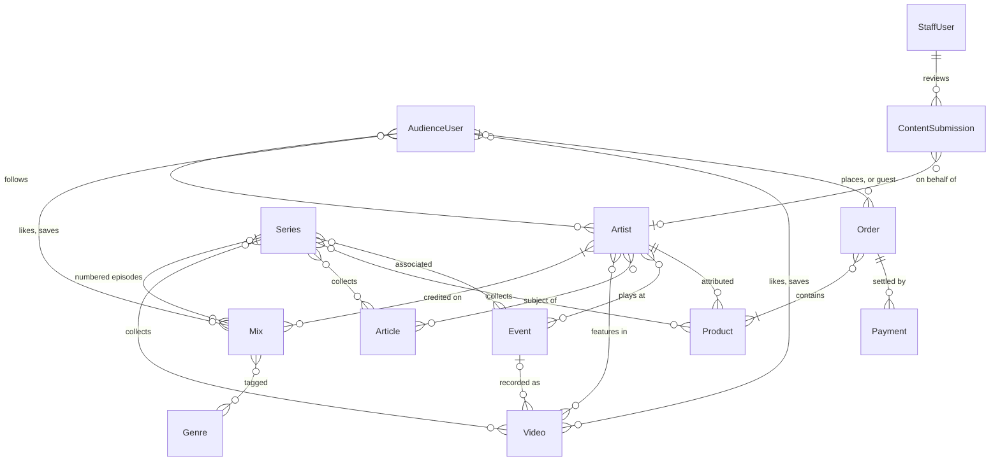
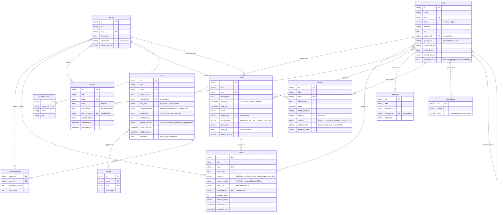
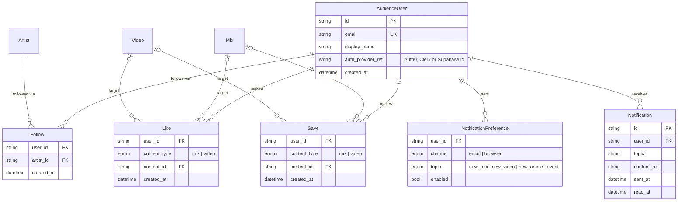
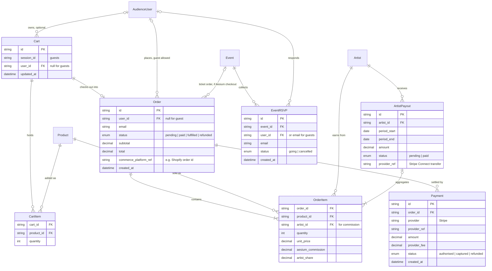
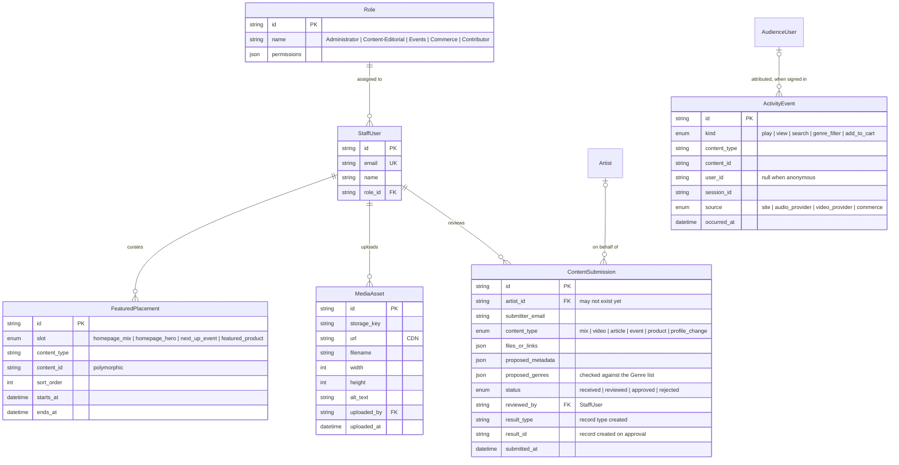

# Aesium Entity Diagram

A first-pass data model drawn from the requirements document, for the developer to validate (§23). It is deliberately concrete so there is something to argue with. Section numbers (§) refer to *Aesium Platform Requirements & Build Options*.

GitHub renders the diagrams below. The [foundation docs](README.md) describe what each area must do.

## Reading the notation

Crow's-foot cardinality, read from the far entity's point of view:

| Symbol | Meaning |
|---|---|
| `\|\|` | exactly one |
| `\|o` | zero or one |
| `}\|` | one or more |
| `}o` | zero or more |

`Artist }|--o{ Mix` reads: each Mix has one or more Artists; each Artist has zero or more Mixes.

## Overview

The core graph without attributes. Content records on the left connect to each other; audience and commerce records hang off them.

## 1. Content graph

Everything Aesium publishes, and how the records connect. Artist Profiles and Series are both "hub" pages over the same content (§8).

Modelling notes:

- Artist ↔ Mix is many-to-many so back-to-back sets and collaborations work. Most mixes will have one artist. A `primary_artist_id` on Mix plus a credits table is an equivalent shape if the developer prefers it.
- `SeriesEpisode` is a junction that carries data (episode number, order), so a mix stays an ordinary mix with an added Series relationship (§8).
- Product → Artist is a single attribution in V1 (§12). Turn it into a junction if co-branded products appear.
- Related artists are derived at read time from shared genres across an artist's mixes (§7). The curated self-link is optional context for collectives.
- `ArtistGroup` covers both an established collective and the shared discovery presentation for artists with limited content (§7).
- Artist external links are defined fields in V1 (§7), not a link table. Series external links are a list.
- Every content entity carries the same publishing fields (§3). Event upcoming / past is derived from `starts_at`, never stored (§11).
- Artwork fields reference `MediaAsset` (see Operations).

## 2. Audience & activity

Free accounts and their private activity. Only `follower_count` on Artist is ever public (§7, §14).

Modelling notes:

- Like and Save point at exactly one of Mix or Video: a `content_type` + `content_id` pair, or two nullable foreign keys.
- `follower_count` is an aggregate over Follow. Follower identities are never exposed; admin visibility is still to be defined (§14).
- Notifications are produced by Follow + publish events, filtered by preferences (§14).
- With a managed auth provider, `AudienceUser` holds only the provider reference plus profile fields; passwords never live in Aesium's database.

## 3. Commerce & payments

Which of these tables exist on Aesium's side depends entirely on the commerce architecture (§12, §13, §15).

Modelling notes:

- With Aesium-owned or headless Shopify, Cart, Order and Payment live in Shopify and Stripe; Aesium keeps references for reporting (§12, §13).
- With artist-owned stores there may be no Cart or Order on Aesium's side at all, only outbound links. A unified cart across independent stores is not established as achievable (§13).
- `OrderItem` carries `artist_id` and the split so Aesium's percentage is calculable per line (§12, §15).
- `ArtistPayout` aggregates order items per period. Stripe Connect could replace it with automatic transfers (§15).
- `EventRSVP` exists only if Aesium hosts RSVP. Tickets sold through Aesium checkout would be Orders (§11).

## 4. Operations

Staff, intake, media, featured placement and activity data behind the Admin / Back Office.

Modelling notes:

- Roles follow §22 and may collapse to Administrator only in V1.
- `ContentSubmission` exists only if the structured submission route is chosen (§14, §21). On approval it produces the real content record.
- `FeaturedPlacement` is polymorphic (slot + content reference) so one mechanism covers homepage mixes, the Next Up event and featured products.
- `MediaAsset` is referenced by every artwork, thumbnail and hero-image field in the content graph.
- `ActivityEvent` may live in the analytics provider rather than the database (§18). Play and view data often arrives from the audio and video providers.

## Decisions that change this diagram

| Decision (§24) | What moves |
|---|---|
| Audio provider | `Mix.audio_*` fields; whether play events are collected or synced |
| Video provider | `Video.video_*` fields; whether view events are collected or synced |
| Commerce model | Whether Cart, Order, Payment, ArtistPayout exist locally or as references |
| Event checkout / RSVP | Whether `EventRSVP` exists; whether Orders can be ticket orders |
| Authentication provider | Shape of `AudienceUser`; possibly `StaffUser` |
| Submission approach | Whether `ContentSubmission` exists |
| Staff permissions | Number of `Role` rows |
| Genre list | `Genre` rows and granularity |
